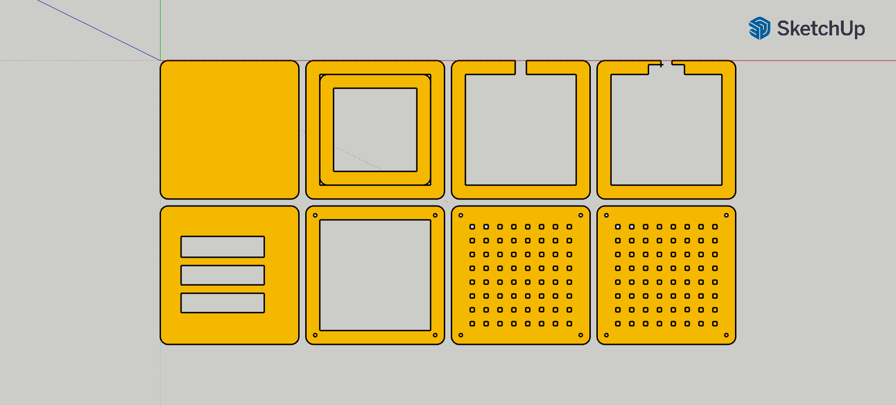

# NeoMatrix Wooden Base LED Illuminator

## Overview
This Arduino project utilizes a Neomatrix and a laser cutter to create a wooden base with 64 holes where acrylic stems are inserted. The Neomatrix is used to illuminate the stems from below, creating an aesthetically pleasing effect.

## Files
- `model/base.dxf`: DXF file containing the design for the wooden base.
- `model/stems.dxf`: DXF file containing the design for the acrylic stems.

## Components
- Arduino Nano
- Neomatrix
- 3 jumper wires
- 3-4mm plywood
- 3mm acrylic plate

## Instructions
1. **Laser Cutting**: Use the provided DXF files to laser cut the wooden base (`base.dxf`) and the acrylic stems (`stems.dxf`). Note that you may need to test multiple times with the laser cutter to ensure the stems fit properly. The provided dxf file only contains 16 stems to minimize material waste during testing.
   
1. **Cut and glue**: Once the base is cut, glue the pieces together. Use the second outside layer as guide when gluing the second inner piece to the bottom.

1. **Wiring**: Connect the Neomatrix to the Arduino Nano using 3 jumper wires connecting them to 5V, GND and a PWM pin. Test before assembling in the box.

1. **Assembly**: Assemble the electronics and glue them to the case. Also cut stems and push them into the grid. If the fit is too tight or too loose, adjust the intensity or speed of the laser.

1. **Code**: Upload Arduino code to the Arduino Nano. Make sure the 

## Note
- Testing with the laser cutter may be required to ensure proper fitting of the acrylic stems. Adjustments may be needed in the design or cutting settings accordingly.
- Ensure all connections are secure and correct before powering up the system to avoid damage to the components.

Enjoy your NeoMatrix Wooden Base LED Illuminator project!